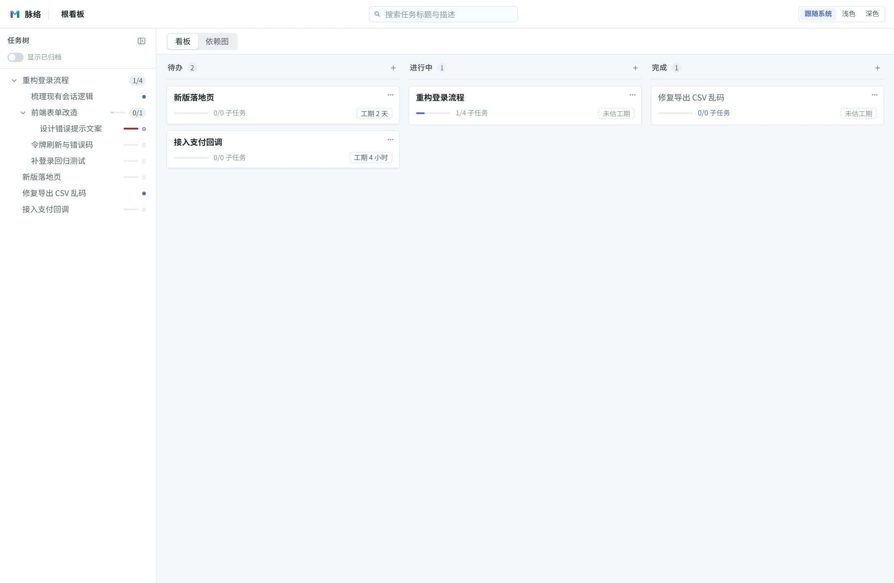
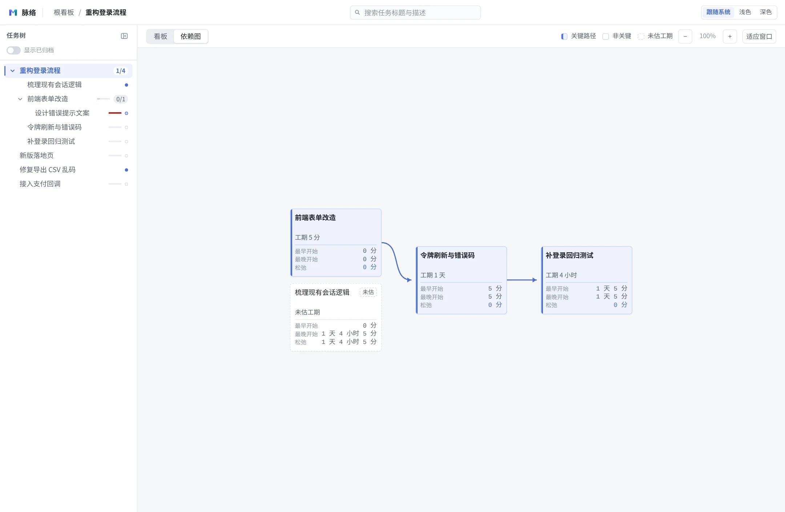
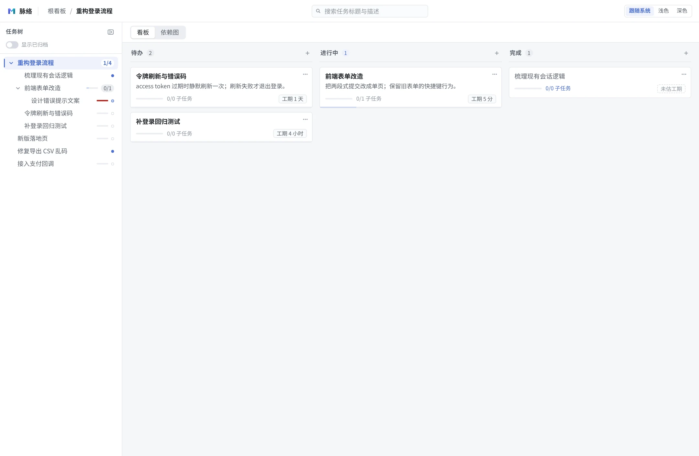
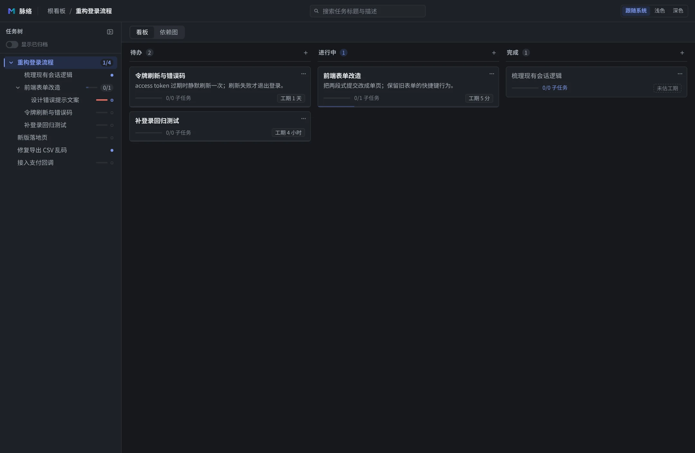

<p align="center">
  
</p>

<h1 align="center">脉络 Mailuo</h1>

<p align="center">
  本地运行的个人任务看板：一个任务一旦有子任务，它自己就是一个看板。<br>
  单机使用，全部任务数据存在本机的一个 SQLite 文件里，不经过任何第三方服务。
</p>

<p align="center">
  <a href="LICENSE"></a>
  
  
  
</p>

<p align="center">
  <a href="#功能特性">功能特性</a> ·
  <a href="#快速开始">快速开始</a> ·
  <a href="#截图">截图</a> ·
  <a href="#命令行参数">命令行参数</a> ·
  <a href="#数据存在哪">数据存在哪</a> ·
  <a href="#常见问题">常见问题</a> ·
  <a href="#开发">开发</a> ·
  <a href="#许可">许可</a>
</p>

## 功能特性

十二条能力，都围绕「任务即看板」这一条组织。

|  |  |  |
| --- | --- | --- |
| **任务即看板**<br>任意任务都可以有子任务，进入任务就是进入它自己的看板；层级深度不限。 | **三列看板**<br>待办 / 进行中 / 完成，三列全项目共用。拖拽跨列移动、同列排序。 | **任务树**<br>左侧展示完整层级，可展开折叠；拖动节点即可改变父级。 |
| **面包屑导航**<br>形如 `根看板 / 重构登录 / 前端部分`，写入浏览器历史，后退键与面包屑一致。 | **卡片进度**<br>卡片角落显示直接子任务的完成计数（例如 `3/5`）。 | **工期估算**<br>按天 / 小时 / 分三个输入框录入（1 天 = 480 分钟），留空表示未估。 |
| **自动计时与工期提醒**<br>任务拖进「进行中」即开始计时，拖出即暂停结算；卡片与任务树上标出「临近 / 超期」，不需要手动按「开始」。 | **依赖图与关键路径**<br>给任务勾选前置依赖（成环会被拒绝），按 CPM 算出关键路径并在图上用强调色区分；图可平移缩放。 | **全库搜索**<br>跨层级匹配标题与描述，命中片段高亮，结果按列分组；支持 ↑ ↓ 选择、Enter 进入、Esc 返回。 |
| **归档**<br>归档一个任务会连同整棵子树，取消归档整棵恢复；「显示已归档」开关默认关闭。 | **深色模式**<br>首次访问跟随系统设置，手动切换后以本地偏好为准。 | **单进程提供全部**<br>命令行只起一个进程，接口与页面都由它提供，默认只监听 `127.0.0.1`。 |

## 快速开始

需要 Node 22 或更高版本。

包发布到 npm 后，可以不安装直接运行，也可以装到全局（scoped 包名，装完命令仍是 `mailuo`）：

```sh
npx @codersgl/mailuo                  # 起服务并自动打开浏览器
npm i -g @codersgl/mailuo && mailuo   # 或者装到全局
```

服务默认监听 `http://127.0.0.1:3001`，并自动打开浏览器。

<details>
<summary>或者从源码运行同一套入口（参数完全一致，需要先构建一次）</summary>

`bin/mailuo.mjs` 与发布后的入口是同一个文件，它加载构建产物，所以要先构建：

```sh
pnpm install
pnpm build
node bin/mailuo.mjs
```

</details>

## 截图

以下均为真实界面。演示数据在临时数据库里，不涉及任何真实任务。

<p align="center">
  
  
</p>

<p align="center">
  <sub>左：根看板，左侧任务树加三列看板，卡片上能看到子任务完成计数与工期。<br>
  右：「重构登录流程」看板的依赖图，按依赖深度分层，标注工期与松弛时间，关键路径用强调色。</sub>
</p>

<p align="center">
  
  
</p>

<p align="center">
  <sub>左：进入任务就是进入它的看板，面包屑、列内卡片、工期与提醒标记都在。<br>
  右：深色模式跟随系统设置，也可以在界面右上角手动切换。</sub>
</p>

## 命令行参数

| 参数 | 环境变量 | 默认值 | 说明 |
| --- | --- | --- | --- |
| `-p, --port` | `PORT` | `3001` | 默认端口被占用时，从它起最多再试 20 个端口（3001–3020）；`--port` 或 `PORT` 显式给出时不替换 |
| `--host` | `HOST` | `127.0.0.1` | 只服务本机；跨设备访问设为 `0.0.0.0` |
| `--db` | `KANBAN_DB_PATH` | `~/.mailuo/kanban.db` | 相对路径按当前工作目录解析 |
| — | `HOST_ALLOW` | 空 | 额外放行的 Host 主机名，逗号分隔 |
| `--no-open` | `MAILUO_NO_OPEN=1` | 打开浏览器 | 不自动打开；`--open` 可压过环境变量 |
| — | `MAILUO_NO_UPDATE_CHECK=1` | 空（启动时查一次） | 不查 npm 上的新版本 |
| — | `MAILUO_REGISTRY` | `https://registry.npmjs.org` | 查新版本用的 registry；未设时跟随 `npm_config_registry`（镜像 / 私有源） |
| `-h, --help` / `-v, --version` | — | — | 用法与版本号 |

参数写法四种都认：`--port 3010`、`--port=3010`、`-p 3010`、`-p3010`。未知参数会报错，不会静默忽略。

优先级：命令行 > 环境变量 > 默认值。命令行启动不读仓库根的 `.env`（那份文件是给 `pnpm dev:*` 用的）。

启动最后会查一次 registry 上有没有新版本，有就打印一行升级命令；包还没发布（404）、
网络不通或超时（1.5 秒）都静默跳过。这一步排在启动横幅与打开浏览器之后，不会拖慢启动。
它走 Node 内置的 `fetch`，不读 npm 的代理配置（`HTTP_PROXY` 与 `.npmrc` 里的 proxy 都不生效），
强制代理的网络里就是没有提示，不影响使用。不想要这一步就设 `MAILUO_NO_UPDATE_CHECK=1`。

## 数据存在哪

- 数据都在一个 SQLite 文件里，默认 `~/.mailuo/kanban.db`；目录不存在时自动创建。
- 命令行启动（`mailuo` / `npx @codersgl/mailuo`）与开发模式（`pnpm dev:api`、`pnpm start`）用的是**同一个**默认文件，两边看到的是同一份任务。
- 位置与包的安装位置、版本无关，重装或升级不会换掉数据。
- 备份时先退出进程再复制：服务运行时同一个目录下还会有 `kanban.db-wal` 与 `kanban.db-shm`，只复制 `.db` 会漏掉最近的写入。
- 用 `--db` 指定别的文件，例如 `mailuo --db ./我的看板.db`。
- 每次启动自动建表，并执行 `apps/api/migrations/` 下未应用过的迁移。

仓库根的 `data/kanban.db` 是 0.1.0 及更早版本开发模式的默认位置，现在不再被读取（文件还在，不会被删）。里面有数据就手动搬一次：退出所有进程后把 `data/kanban.db`、`data/kanban.db-wal`、`data/kanban.db-shm` 三个文件一起覆盖到 `~/.mailuo/` 下，或者直接把库挪到别处再用 `--db` 指过去。

开发时想用一个临时库（不影响日常数据），用命令行前缀指过去即可：`KANBAN_DB_PATH=$(pwd)/.tmp/kanban.db pnpm dev:api`。

## 常见问题

<details>
<summary>端口 3001 被占用怎么办？</summary>

默认端口被占用时会从它起往后试，最多试 20 个端口（3001–3020）。`--port` 或 `PORT` 显式给出时不做替换，被占用就直接报错，换一个即可：`mailuo --port 3002`。

</details>

<details>
<summary>想用手机或另一台设备访问？</summary>

默认只监听 `127.0.0.1`，即只服务本机。`--host 0.0.0.0`（或 `HOST=0.0.0.0`）之后，同网段设备用本机 IP 就能打开；用机器名或 MagicDNS 名字访问要把名字写进 `HOST_ALLOW`，否则会被拒绝。接口没有鉴权，同网段的任何设备都能读写全部任务，只在你确信可信的网络里这么做。

</details>

<details>
<summary>升级会丢数据吗？</summary>

不会。数据库不在包的安装目录里，升级只替换程序。

</details>

<details>
<summary>支持多人协作吗？</summary>

不支持，也不打算支持。没有账号、没有协作，数据只有本机这一份。

</details>

## 开发

源码开发、构建、测试、环境变量与图标流程见 [`docs/development.md`](docs/development.md)。

- 规范：[`docs/spec.md`](docs/spec.md)
- 需求与待办：[`docs/intend.md`](docs/intend.md)
- 决策记录：[`docs/decisions.md`](docs/decisions.md)

## 许可

[AGPL-3.0-only](LICENSE)
